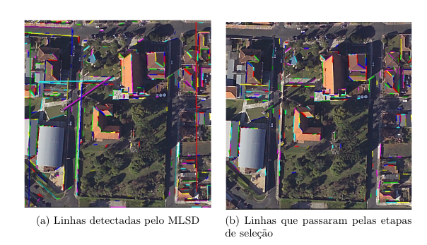

# AutomaticLineExtraction

## O que é este projeto?

É um conjunto de arquivos de códigos para detecção de segmentos de linhas de telhados em imagens aéreas. O algorito utilizado para a detecção dos segmentos de linhas é o [MLSD](https://github.com/ySalaun/MLSD) de autoria de Yohann Salaun, Renaud Marlet e Pascal Monasse.

Para selecionar as linhas detectadas pelo MLSD, utiliza-se uma nuvem de pontos dos telhados, assim, quando uma linha é detectada em uma região de baixa densidade de pontos, esta é eliminada por não se tratar de uma linha de telhados.

## Requisitos

- OpenCV;
- Point Cloud Library;
- MLSD;
- pyclustering.

## Resultados Alcançados

Na Figura (a) tem-se os resultados alcançados pelo algoritmo MLSD, isto é, as linhas que foram detectadas pelo algoritmo sem utilizar a nuvem de pontos para refinamento da solução.

Na Figura (b) estão os alinhamentos que foram selecionados após a fusão dos dados, isto é, utilizou-se a nuvem de pontos para selecionar apenas as linhas que realmente delimitam telhados de edificações.